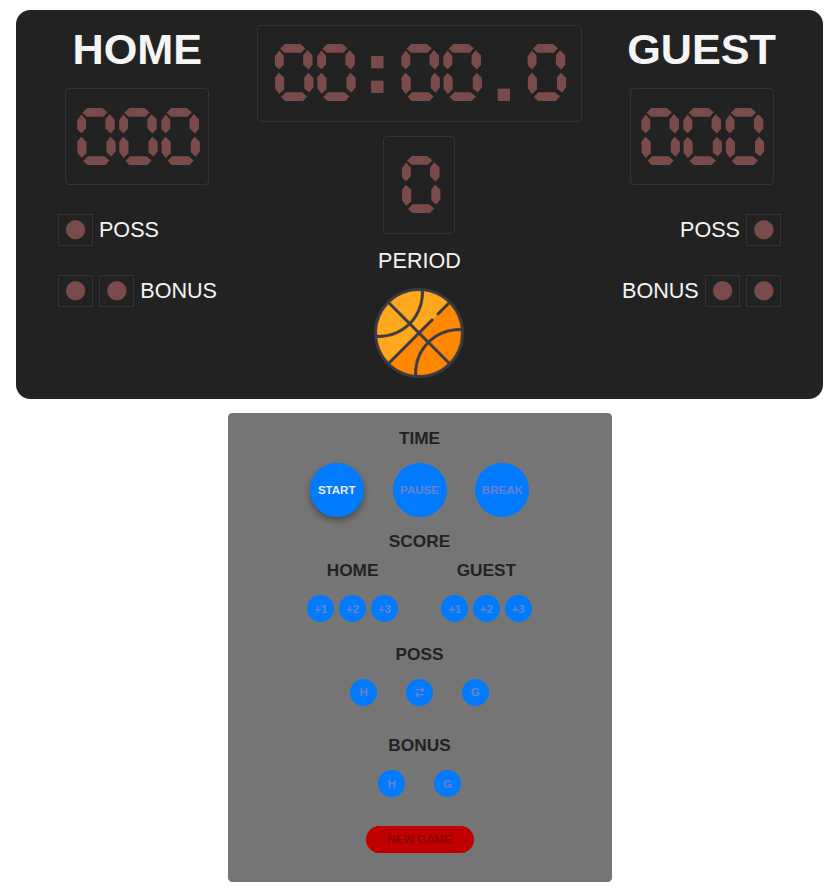

# 🏀 Basketball Scoreboard

A digital basketball scoreboard built with plain JavaScript, HTML, and CSS. This project simulates a real game scoreboard including period timer, score tracking, possession and bonus indicators, and game state transitions (pause, resume, break, and new game).

---

## 🚀 Features

- ⏱️ **Game Timer** with tenths of a second
- 📈 **Score Tracking** for both teams (1, 2, and 3 point increments)
- 🔄 **Start / Pause / Resume / Break** handling
- 🔁 **Possession Control** between teams
- 🎯 **Bonus Indicators** per team
- 🔄 **New Game** reset functionality
- 🖥️ **Active visual feedback** on board elements and control buttons

---

## 📁 File Structure

/basketball-scoreboard/
│
├── index.html # Main HTML structure
├── src/
│ └── css/
│ └── styles.css # Styles for the board and buttons
├── script.js # Core logic for time, score, and control
└── README.md # You're here!

---

## ✅ Requirements

This is a **vanilla JavaScript** project. No frameworks, no build tools.

To run:
- Any modern browser (Chrome, Firefox, Edge, Safari)

---

## 🧩 Controls Overview

### Time Controls
- `Start`: Begins a new period
- `Pause / Resume`: Pauses and resumes the game clock
- `Break`: Starts break time between quarters
- `New Game`: Resets everything for a fresh start

### Score Controls
- `+1`, `+2`, `+3` buttons for both Home and Guest teams

### Possession & Bonus
- Assign possession to Home or Guest
- Toggle between teams
- Add bonus indicators (up to two per team)

---

## 🛠️ How It Works

- Time is tracked in `tenths of seconds`
- A game consists of **4 periods**, and supports **overtime**
- If the scores are tied at the end of period 4, overtime is initiated
- Scores are always displayed as 3-digit values (e.g., `005`)

---

## 📸 Demo

> 

---

## 📃 License

This project is open-source and free to use. Feel free to improve and share it!

---

## 🙌 Acknowledgments

Built with passion for live sports, practice, and experimentation.